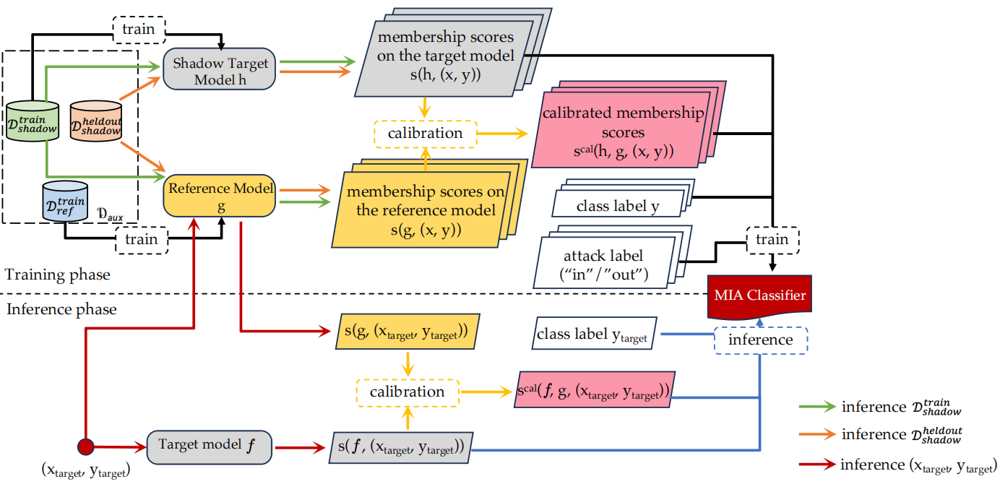

# LDC-MIA(membership inference attack)
The source code of the paper **"Learning-Based Difficulty Calibration for Enhanced Membership Inference Attacks"**(https://arxiv.org/abs/2401.04929), in IEEE European Symposium on Security and Privacy(**EuroS&P 2024**).



# Usage
Experimental procedure:
- STEP 1: Train the target model
- STEP 2: Train the shadow model.
- STEP 3: Train the reference model and MIA classifier.
- STEP 4: LDC-MIA(Membership inference attack).
### Configure the environment needed for the experiment
```
pip install -r requirements.txt
```
- Create the following four folders to store the **target model**, **reference model**, **shadow model** and **mia classifie**r respectively.
```
cd LDC-MIA
mkdir private_model
mkdir reference_model
mkdir shadow_model
mkdir mia_classifier
```
- Create folders to store the **mask** for each part of the data
```
cd LDC-MIA
mkdir data
mkdir data/hidden
```
### Example(CIFAR 10, WideResNet)
- **STEP 1**: Train the target model
```
python train_private_model.py --dump_path ./private_model --mask_path none --architecture wrn28_10 --dataset cifar10 --optimizer sgd,lr=cos:0.01,momentum=0.9 --batch_size 64 --epochs 25
```
- **STEP 2**: Train the shadow model.
```
python train_shadow_model.py --dump_path ./shadow_model --mask_path ./data/ --architecture wrn28_10 --dataset cifar10 --optimizer sgd,lr=cos:0.01,momentum=0.9 --batch_size 64 --epochs 25
```
- **STEP 3**: Train the reference model and MIA classifier.
```
python MIA_classifier.py --dump_path reference_model --shadow_path shadow_model --mia_model_path mia_classifier --dataset cifar10 --mask_path ./data/ --attack_architecture wrn28_10 --private_architecture wrn28_10 --classifier_num_dimensions 12 --optimizer sgd,lr=cos:0.01,momentum=0.9 --epochs 25 --classifier_epochs 35 --batch_size 64 --cos_threshold 0
```
- **STEP 4**: LDC-MIA(Membership inference attack).
```
python privacy_attacks.py --dump_path reference_model --model_path private_model --classifier_path mia_classifier --mask_path ./data/ --dataset cifar10 --private_architecture wrn28_10 --attack_architecture wrn28_10 --classifier_num_dimensions 12 --num_classes 10 --cos_threshold 0
```

### Details
- **STEP 1**: Train the target model
```
python train_private_model.py --dump_path [path to private model] --mask_path [none] --architecture [target model architecture] 
                                --dataset [dataset] --optimizer [optimizer selection] --batch_size [batch_size]  --epochs [epochs]

optional arguments:
  --dump_path    //path to store private model
  --mask_path    //path to store the target model training dataset mask
                   none(if it's the first time to train the target model)
  --architecture [smallnet, linear, wrn28_10, densenet121, mlp, vgg16]
  --dataset      [cifar10, cifar100,  credit, adult, cinic10]
  --optimizer    //training optimizer
  --batch_size   //batch size
  --epochs       //training epochs
```

- **STEP 2**: Train the shadow model.
```
python train_shadow_model.py --dump_path [path to shadow model] --mask_path ./data/ --architecture [shadow model architecture] 
                               --dataset [dataset] --optimizer [optimizer selection] --batch_size [batch_size]  --epochs [epochs] 
optional arguments:
  --dump_path    //path to store shadow model
  --mask_path    //path to store the shadow model training dataset mask
                  (none if it's the first time to run the experiment)
  --architecture [smallnet, linear, wrn28_10, densenet121, mlp, vgg16]
  --dataset      [cifar10, cifar100,  credit, adult, cinic10]
  --optimizer    //training optimizer
  --batch_size   //batch size
  --epochs       //training epochs
```

- **STEP 3**: Train the reference model and MIA classifier.
```
python MIA_classifier.py  --dump_path [path to reference model] --shadow_path [path to shadow model] --mia_model_path [path to mia classifier] --dataset [dataset] --mask_path ./data/
                          --attack_architecture [model architecture] --private_architecture [model architecture] --classifier_num_dimensions [input features of mia classifier]
                          --optimizer [optimizer selection] --epochs [epochs] --classifier_epochs [epochs] --batch_size [batch_size]  --cos_threshold [Eq 8 threshold selection]
optional arguments:
  --dump_path             //path to store reference model
  --shadow_path           //path to store the shadow model
  --mia_model_path        //path to store the mia classifier
  --dataset               [cifar10, cifar100,  credit, adult, cinic10] 
  --mask_path             ./data/
  --attack_architecture   [smallnet, linear, wrn28_10, densenet121, mlp, vgg16] // architecture of reference model
  --private_architecture  [smallnet, linear, wrn28_10, densenet121, mlp, vgg16] // architecture of shadow model
  --classifier_num_dismensions //number of input features of mia classifier, len(number of classes+2) (eg. for cifar10: 12; for cifar100: 102)
  --optimizer             //training optimizer
  --batch_size            //batch size
  --epochs                //training epochs for reference model
  --classifier_epochs     //training epochs for mia classifier
  --cos_threshold         //cosine similarity threshold selection for enhanced calibrated membership score
```


- **STEP 4**: LDC-MIA(Membership inference attack).
```
python privacy_attacks.py --dump_path [path to reference model] --model_path [path to target model] --classifier_path [path to mia classifier] --mask_path ./data/ 
                          --dataset [dataset] --private_architecture [model architecture] --attack_architecture [model architecture] 
                          --classifier_num_dimensions [input features of mia classifier] --num_classes [number of classes] --cos_threshold [Eq 8 threshold selection]
optional arguments:
  --dump_path             //path to store reference model
  --model_path            //path to store the target model
  --classifier_path       //path to store the mia classifier
  --mask_path             ./data/
  --dataset               [cifar10, cifar100,  credit, adult, cinic10] 
  --private_architecture  [smallnet, linear, wrn28_10, densenet121, mlp, vgg16] // architecture of private model
  --attack_architecture   [smallnet, linear, wrn28_10, densenet121, mlp, vgg16] // architecture of reference model
  --classifier_num_dismensions //number of input features of mia classifier, len(number of classes+2) (eg. for cifar10: 12; for cifar100: 102)
  --num_classes           //number of classes of dataset
  --cos_threshold         //cosine similarity threshold selection for enhanced calibrated membership score

```
